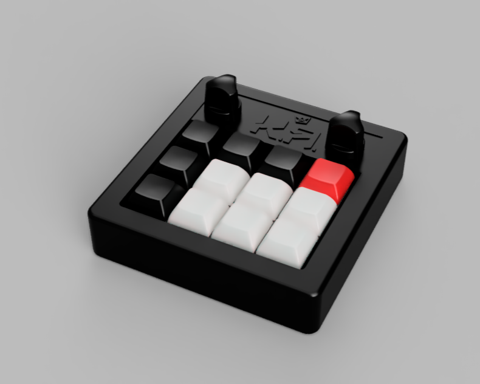

# TITANPAD

TITANPAD is a custom 12-key macropad with two rotary encoders, designed for versatility and ease of use. It features a compact and ergonomic layout, making it perfect for productivity, gaming, and creative applications.


## Features
- 12 programmable keys with Cherry MX switches
- 2 rotary encoders for enhanced control
- Custom QMK firmware compatibility
- Compact 3D-printed case
- Powered by Seeed XIAO RP2040

## Bill of Materials (BOM)
| Quantity | Component |
|----------|------------|
| 12 | Cherry MX Switches |
| 12 | Through-hole 1N4148 diodes |
| 2 | EC11 Rotary Encoders |
| 5 | Blank DSA Keycaps (Black) |
| 6 | Blank DSA Keycaps (White) |
| 1 | Blank DSA Keycap (Red) |
| 4 | M3x16mm Screws |
| 4 | M3x533x433 Heatset Inserts |
| 3 | 3D Printed Case Parts (Black: top, plate, bottom) |
| 1 Set | Header Pins for Seeed XIAO RP2040 |

## Assembly Instructions
1. Solder the 1N4148 diodes onto the PCB.
2. Mount and solder the Cherry MX switches.
3. Install the EC11 rotary encoders.
4. Attach the header pins to the Seeed XIAO RP2040 and solder it to the PCB.
5. Assemble the 3D-printed case using the M3 screws and heatset inserts.
6. Install keycaps onto the switches.
7. Flash QMK firmware onto the microcontroller.

## Firmware
TITANPAD is powered by QMK firmware, allowing for full customization of key mappings and macros. 

To compile and flash the firmware:
```bash
qmk setup
qmk compile -kb titanpad -km default
qmk flash -kb titanpad -km default
```
