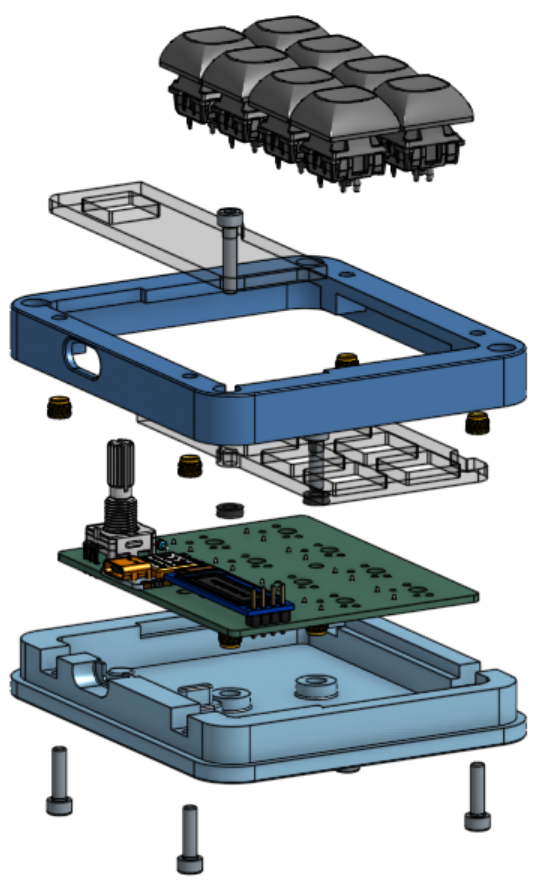
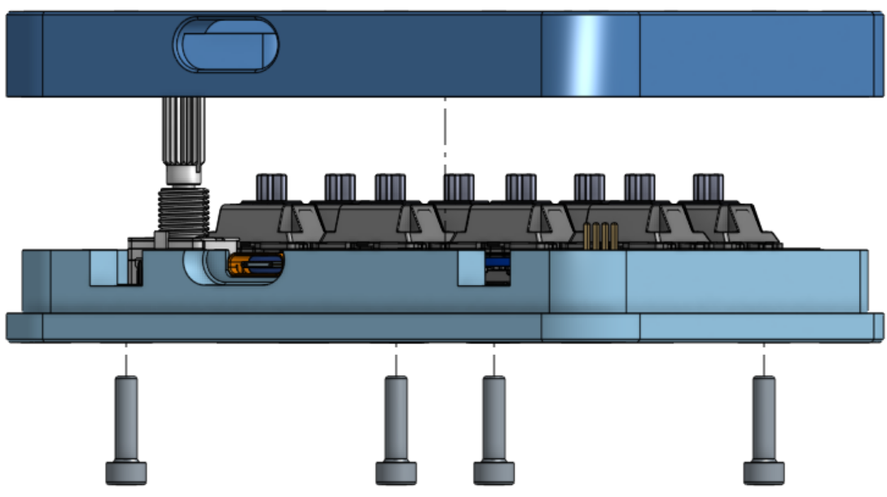

# BOM
## Case
- 1x Case Bottom - 3d print
- 1x Case Top - 3d print
- 2x M3 Standoff - 3d print
- 1x Keyplate - Lasercut 3mm clear
- 1x Top Plate - Lasercut 3mm clear
- 5x M3 12mm Bolt
- 1x M3 16mm Bolt
- 6x M3 Heat set inserts
## PCB
- 1x PCB - Purple w/ white silkscreen
- 1x XIAO RP2040
- 9x Through-hole 1N4148 Diode
- 8x Cherry MX Keyswitch
- 1x EC11 Encoder
- 1x .91" 128x32 OLED
## Other
- 8x DSA Keycaps
- 1x Dial

# Assembly Guide
No promises that this is actually helpful, I have no experience with custom keyboard

1. Heat set the six M3 inserts into the case

2. Solder the PCB

    - 8 THT 1N4148 Diodes mount to the underside of the board
    - 1 Diode, The EC11 encoder, XAIO, & OLED atach to the top of the board
        - The OLED should be placed flush against the black spacer on its pins (0.1" or 2.54mm off the surface of the board)
        - Trim the pins of the OLED to below 5mm off the surface of the board (as close to flush with the OLED as possable is ideal)
3. Install the keyswitches

    - Place the swiches in the larger acrylic plate
    - Possition the M3 standoffs over the holes in the middle of the board, This will be diffcult to do later
    - Install the plate on the board and solder the switches
4. Mount the board in the bottom case

    - Only install the lower 12mm M3 bolt at this stage
5. Install the top of the case

    - The top 3D printed case piece can be secured with four M3 12mm bolts from the bottom
6. Install the top plate

    - Secure in place with a M3 16mm bolt through the remaining hole in the PCB
7. Flash the firmware
    - I hope you know how to do this cause I don't :)
    - The dial is (0,0) in the matrix
8. Keycaps & Dial
